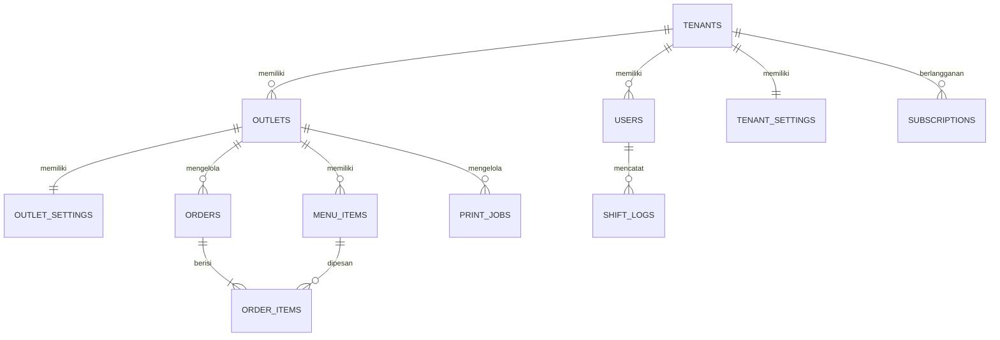

# 🛠️ Panduan Rancangan Backend Development — Restoku POS

Panduan ini mendefinisikan arsitektur aktual sistem backend **Restoku POS** yang telah diimplementasikan menggunakan pola **Database Relasional Penuh** (Laravel Eloquent + SQLite/MySQL) dengan **6-Layer Enterprise Multi-Tenant SaaS Architecture**.

> [!IMPORTANT]
> Dokumen ini telah diperbarui untuk mencerminkan **kondisi codebase aktual**. Arsitektur ini sudah **sepenuhnya diimplementasikan** — bukan lagi dokumen perencanaan. Seluruh migrasi dari Cache/Session-based ke database relasional telah selesai.

---

## 1. Arsitektur Multi-Tenancy & Organisasi Data

Restoku POS dirancang menggunakan arsitektur **Single Database Multi-Tenancy** (Shared Database, Shared Schema). Pemisahan data antar penyewa (*tenant*) dilakukan menggunakan kolom kunci asing `tenant_id`, dan diperkuat secara otomatis oleh `TenantScope` sebagai Eloquent Global Scope.



- **Tenants**: Entitas bisnis restoran induk (SaaS Subscriber).
- **Outlets**: Cabang fisik restoran (misal: "Senopati", "Puri Indah").
- **Users**: Karyawan (Kasir, Waiter, Manager) yang memiliki PIN dan relasi role.
- **Subscriptions**: Paket berlangganan dengan tier `basic`, `pro`, `enterprise`.
- **TenantSettings / OutletSettings**: Konfigurasi berjenjang (Outlet → Tenant → Default).

---

## 2. Layer Services — Application Domain Logic

Seluruh logika bisnis dikumpulkan di `app/Services/` (Layer 3):

### A. `TenantContext` (Singleton Resolver)
File: `app/Services/TenantContext.php`

Bertindak sebagai SSOT identitas tenant selama *request lifecycle*. Di-resolve oleh middleware `EnsureTenantContext` di setiap request terotentikasi.

```php
// Cara penggunaan di Controller
public function __construct(private TenantContext $ctx) {}

$tenantId = $this->ctx->id();         // int: ID tenant
$tenant   = $this->ctx->tenant();     // Tenant model
$outlet   = $this->ctx->outlet();     // Outlet model aktif
$plan     = $this->ctx->plan();       // 'basic' | 'pro' | 'enterprise'
```

### B. `FeatureRegistry` (Plan Hierarchy Truth)
File: `app/Services/FeatureRegistry.php`

Pusat registrasi fitur yang memetakan nama fitur ke tier minimum:

```php
// Contoh internal mapping
private const FEATURES = [
    'kds'                  => 'enterprise',
    'perbandingan_outlet'  => 'pro',
    'staf_shift'           => 'pro',
    'inventory'            => 'pro',
];

// Cara penggunaan
$registry->canAccess('kds', 'basic');       // false
$registry->canAccess('kds', 'enterprise'); // true
```

### C. `SettingsService` (Fallback Chain + Self-Healing Cache)
File: `app/Services/SettingsService.php`

Mesin konfigurasi berjenjang: Outlet → Tenant → Default System, dengan proteksi cache anti-`__PHP_Incomplete_Class`:

```php
// Membaca settings dengan auto-create jika belum ada
$outletSetting = $settings->forOutlet($outlet->id); // OutletSetting model
$tenantSetting = $settings->forTenant($tenantId);   // TenantSetting model

// Self-healing: jika cache corrupt, otomatis invalidasi & re-fetch dari DB
// TIDAK menggunakan Cache::remember() — menggunakan Cache::get() + instanceof check
```

### D. `OwnerDashboardService` (Financial Analytics)
File: `app/Services/OwnerDashboardService.php`

Mengagregasi data transaksi nyata dari database — **tidak menggunakan mock data**.

---

## 3. Skema Database & Model Eloquent Aktual

Berikut adalah model-model yang sudah ada di `app/Models/`:

### Model yang Tersedia
| Model | File | Keterangan |
|-------|------|------------|
| `Tenant` | `Tenant.php` | Entitas bisnis induk SaaS |
| `Outlet` | `Outlet.php` | Cabang restoran dengan `TenantScope` |
| `User` | `User.php` | Karyawan dengan role dan PIN |
| `Subscription` | `Subscription.php` | Paket langganan aktif |
| `TenantSetting` | `TenantSetting.php` | Konfigurasi level tenant |
| `OutletSetting` | `OutletSetting.php` | Konfigurasi level outlet (pajak, jam, struk) |
| `Order` | `Order.php` | Transaksi POS dengan `TenantScope` |
| `OrderItem` | `OrderItem.php` | Item per transaksi |
| `MenuItem` | `MenuItem.php` | Produk/menu dengan `TenantScope` |
| `MenuCategory` | `MenuCategory.php` | Kategori menu |
| `PrintJob` | `PrintJob.php` | Antrian cetak thermal printer |
| `ReceiptConfig` | `ReceiptConfig.php` | Konfigurasi tampilan struk |
| `Reservation` | `Reservation.php` | Reservasi meja tamu |
| `AuditLog` | `AuditLog.php` | Riwayat perubahan data kritis |

### Global Scope: `TenantScope`
File: `app/Models/Scopes/TenantScope.php`

```php
// ✅ Implementasi aktual — membaca dari TenantContext (bukan Session)
class TenantScope implements Scope
{
    public function apply(Builder $builder, Model $model): void
    {
        $tenantId = app(TenantContext::class)->id();
        if ($tenantId) {
            $builder->where($model->getTable() . '.tenant_id', $tenantId);
        }
    }
}
```

> [!WARNING]
> **BUKAN** menggunakan `Session::get('active_tenant_id')` seperti yang tertulis di dokumentasi lama. `TenantScope` aktual membaca dari `TenantContext` yang di-resolve dari middleware.

---

## 4. Middleware Stack (Layer 4 — HTTP Gateway)

File yang ada di `app/Http/Middleware/`:

| Middleware | File | Fungsi |
|-----------|------|--------|
| `EnsureTenantContext` | `EnsureTenantContext.php` | Resolve & inject `TenantContext` ke Service Container |
| `RequiresPlan` | `RequiresPlan.php` | Cek `FeatureRegistry` — tolak HTTP 402 jika plan kurang |
| `HandleInertiaRequests` | `HandleInertiaRequests.php` | Inject Shared Props ke semua halaman Inertia |

### Penggunaan di Route
```php
// Route dengan feature gating lengkap
Route::get('/kds', [KDSController::class, 'index'])
    ->middleware(['auth', 'tenant', 'plan:kds']);

Route::get('/staf-shift', [StafShiftController::class, 'index'])
    ->middleware(['auth', 'tenant', 'plan:staf_shift']);

// Endpoint settings atomik
Route::put('/api/outlet-settings/all', [OutletSettingsController::class, 'saveAll'])
    ->middleware(['auth', 'tenant']);
```

---

## 5. Alur Controller yang Benar (Data Flow)

### ✅ Pattern Aktual: Inertia Response dengan Shared Props

```php
// OutletSettingsController::index() — implementasi aktual
public function index(): Response
{
    $tenantId       = $this->ctx->id();
    $tenant         = $this->ctx->tenant();
    $outlet         = Outlet::when($user->outlet_id, ...)->first();
    $outletSettings = $this->settings->forOutlet($outlet->id);
    $employees      = User::where('role', '!=', 'owner')->get();

    return Inertia::render('PengaturanOutlet/Index', [
        'tenant'    => $tenant,
        'outlet'    => $outlet,
        'settings'  => $outletSettings,
        'employees' => $employees,
    ]);
}
```

### ✅ Endpoint Atomik: Save Semua Pengaturan dalam 1 Transaksi

```php
// PUT /api/outlet-settings/all — menyimpan profil, lokasi, pajak, jam operasional
// dalam satu DB::transaction() untuk konsistensi data
public function saveAll(Request $request): JsonResponse
{
    return DB::transaction(function () use ($request) {
        // Update Tenant (profil bisnis)
        $this->ctx->tenant()->update($request->validated('profil'));

        // Update Outlet (lokasi & geofence)
        $outlet->update($request->validated('lokasi'));

        // Update TenantSettings (pajak, service charge)
        $this->settings->saveTenantSettings($tenantId, $request->validated('pajak'));

        // Update operating hours
        $outlet->update(['operating_hours' => $request->validated('jam.operating_hours')]);

        // Invalidate cache
        $this->settings->invalidateTenant($tenantId);
        $this->settings->invalidateOutlet($outlet->id);

        return response()->json(['success' => true]);
    });
}
```

---

## 6. Rencana Kerja Pengembangan Lanjutan

Arsitektur dasar telah selesai. Berikut roadmap fitur berikutnya:

1. **Fitur Real-time (WebSocket/Pusher):** Update KDS & Monitor Pesanan secara real-time tanpa polling.
2. **Modul Payroll & HRD Penuh:** Kalkulasi gaji, slip gaji digital PDF, overtime tracking.
3. **Laporan Keuangan PDF/Excel Export:** Generator laporan menggunakan `barryvdh/laravel-dompdf`.
4. **WhatsApp Notification API:** Integrasi Fonnte/WablasAPI untuk notifikasi laporan harian owner.
5. **Multi-outlet Dashboard:** Perbandingan KPI antar cabang dalam satu grafik (tier Pro).

---

## 7. Verifikasi & Testing Setelah Setiap Perubahan

> [!IMPORTANT]
> Setiap perubahan kode **WAJIB** diverifikasi dengan TDR suite sebelum dianggap selesai:

```bash
# Wajib setelah setiap perubahan kode
npm run tdr

# Wajib setelah perubahan rute atau controller
npm run tdr:e2e
```

Baca detail lengkap di `TDR_WORKFLOW_GUIDE.md`.
