# Restoku — E2E Workflow: Subscription → Closing Shift Operasional

> **Legenda warna**
> 🟢 = sudah ada di kode (terbukti) · 🟡 = sebagian ada (route/placeholder) · 🔴 = FUTURE / belum dibangun
> Sumber: `routes/web.php`, `app/Http/Controllers/*`, `resources/js/Pages/BukuMenuDigital/*`, PRD.md (Fase 0–4)

```mermaid
flowchart TD
    %% ============ ACTOR ============
    subgraph A0["👤 Visitor / Landing"]
        L1[Landing page] --> L2{Pilih Paket?}
        L2 -->|klik| SUB
    end

    %% ============ 1. SUBSCRIPTION (SIMULASI) ============
    subgraph S1["💳 Subscription — SIMULASI (no real gateway)"]
        SUB["GET/POST /subscribe/{plan}<br/>throttle · publik"] --> S2["Subscription::store<br/>status = 'trialing'<br/>trial 14 hari · current_period_end = null"]
        S2 --> S3["intended_plan disimpan di session"]
        S3 --> S4["redirect → /owner/login"]
    end

    %% ============ 2. OWNER ONBOARDING ============
    subgraph O1["🏪 Owner (email+password)"]
        S4 --> O1L["Owner login<br/>Auth::attempt · allowedRoles['owner']"]
        O1L --> O2["intended_plan diterapkan saat login"]
        O2 --> O3["Outlet auto-default (kalau belum ada)<br/>slug global-unik"]
        O3 --> O4["OutletSettings<br/>screen_mode · logo · cloudinary"]
        O4 --> O5["QR Generator Meja<br/>buildMenuUrl /m/{slug}?t={meja}"]
    end

    %% ============ 3. TAMU / e-MENU ============
    subgraph T1["📱 Tamu — Buku Menu Digital (e-Menu)"]
        O5 -.print/scan.-> T1Q["Scan QR → /m/{slug}?t={meja}"]
        T1Q --> T2["Onboarding: landing→welcome→howto→app"]
        T2 --> T3["Browse menu (cache Redis)"]
        T3 --> T4["Tambah ke cart"]
        T4 --> T5["Tab Cart → GuestVerifyGate"]
        T5 --> T6{"Verifikasi kehadiran"}
        T6 -->|PIN Meja + PIN Harian<br/>GPS skip kalau lat=null| T7["onVerified → guestVerified = true"]
        T7 --> T8["Tombol 'Kirim Pesanan Ke Dapur' AKTIF"]
    end

    %% ============ 4. ORDER KE DAPUR ============
    subgraph ORD["🍳 Order Pipeline"]
        T8 --> OR1["POST /api/orders<br/>throttle:30,1 · CSRF-exempt"]
        OR1 --> OR2["OrderController (tenant-scoped<br/>EnsureTenantContext)"]
        OR2 --> OR3[(orders table<br/>table_number · tenant_id)]
    end

    %% ============ 5. KASIR / KDS ============
    subgraph K1["👨‍🍳 Kasir & KDS (web)"]
        OR3 --> K1G["KDS: GET /api/orders<br/>(antrian realtime)"]
        K1G --> K1U["KDS: PUT /api/orders/{id}/status<br/>updateOrderStatus"]
        K1U --> K2["Order 5-stage: antrian_masuk→diterima→sedang_dimasak→selesai_masak→siap_sajikan→siap_bayar→selesai | Item per-item: dikonfirmasi→sedang dimasak→selesai masak→siap sajikan→selesai"]
    end

    %% ============ 6. STAF SHIFT ============
    subgraph SH["🕒 Staf Shift"]
        K2 --> SH1["/staf-shift (plan: staf_shift)"]
        SH1 --> SH2["Buka session kasir 🟡<br/>(CashierSession belum ada model)"]
    end

    %% ============ 7. CLOSING SHIFT (FUTURE) ============
    subgraph CL["🔴 CLOSING SHIFT OPERASIONAL — BELUM LENGKAP"]
        SH2 --> C1["Kasir 'Tutup Shift' 🔴<br/>update session → closed"]
        C1 --> C2["Rekonsiliasi kas 🔴<br/>selisih akhir-awal vs total_sales"]
        C2 --> C3["/laporan/shift 🟡<br/>OwnerDashboard::laporanShift<br/>baca cashier_sessions (kosong)"]
        C3 --> C4["LaporanShift/Index 🟡<br/>total_sales per kasir"]
        C4 --> C5["Rollup ke Owner Dashboard 🟡<br/>Fase 3 (O(1) per hari)"]
    end

    %% ============ NOTES ============
    N1["PRD non-goal: NO payment gateway bawaan<br/>→ subscription = simulasi, gateway sungguhan DEFERRED"]
    N2["Fase 2: schema-per-tenant + Redis aktif + partisi orders<br/>prasyarat prod 5000 tenant"]
    N1 -.-> SUB
    N2 -.-> OR3
```

## Status per tahap (grounded di kode, 2026-07-15)

| # | Tahap | Status | Bukti kode |
|---|-------|--------|-------------|
| 1 | Subscription (simulasi) | 🟢 ada | `routes/web.php:32-35`, `SubscriptionController` |
| 2 | Owner login + outlet + QR | 🟢 ada | `OwnerDashboardController`, `OutletSlug`, `buildMenuUrl` |
| 3 | e-Menu + GuestVerifyGate | 🟢 ada | `CustomerView.tsx`, `GuestVerifyGate.tsx` (fix Opsi A `7dd513e`) |
| 4 | POST /api/orders | 🟢 ada | `web.php:57`, `PublicOrderController::submitOrder` |
| 5 | KDS antrian + status | 🟢 ada | `web.php:218-219`, `KdsController` |
| 6 | Staf Shift | 🟡 route ada, session belum | `web.php:180`, `StafShift/Index`, `ShiftSchedule` |
| 7 | **Closing Shift** | 🔴 belum | `laporanShift` baca `cashier_sessions` (model tdk ada) — hanya placeholder |

**Catatan kritis:** Tahap 7 (closing shift operasional: tutup kas + rekonsiliasi selisih) **BELUM dibangun**. Yang ada baru route `/laporan/shift` yang menampilkan ringkasan per kasir, tapi `CashierSession` model/controller tidak ditemukan → data kosong. Ini masuk roadmap Fase 3–4 (rollup & arsip).

## Verifikasi Tamu (e-Menu) — Konsolidasi Opsi A (2026-07-15, commit `7dd513e`)

Sebelum fix, ada **DUA jalur verifikasi yang tumpang tindih & salah wiring**:
- Modal PIN legacy ("VERIFIKASI DINE-IN") → `setDineVerified(true)` — **bukan** `guestVerified` yang mengunci checkout.
- `GuestVerifyGate` (resmi) → `onVerified` → `setGuestVerified(true)` → checkout aktif.

Akibatnya tamu yang sudah input PIN tetap lihat "🔒 Verifikasi Dulu" (tombol terkunci).

**Fix:** Hapus modal PIN legacy + state `dineVerified`/`pin`. `GuestVerifyGate` menjadi **SATU-SATUNYA gate**. Alur sekarang:
1. Tamu add item → buka **Cart tab**.
2. `GuestVerifyGate` muncul: input **PIN Meja** + **PIN Harian** (fetch `/api/guest/verify`).
3. GPS di-skip kalau outlet **tanpa koordinat** (`latitude=null`, mis. pawon-salam) → cukup PIN.
4. Verify sukses → `guestVerified=true` → tombol **"Kirim Pesanan Ke Dapur"** aktif (bisa diklik).

**Bukti tests:** `customerView.test.tsx` (checkout locked "Verifikasi Dulu" sebelum verify → "Kirim Pesanan Ke Dapur" setelah `guestVerified`) + `guestVerifyGate.test.tsx` (PIN / GPS / wrong-PIN). FE suite: **234/234 PASS**.
