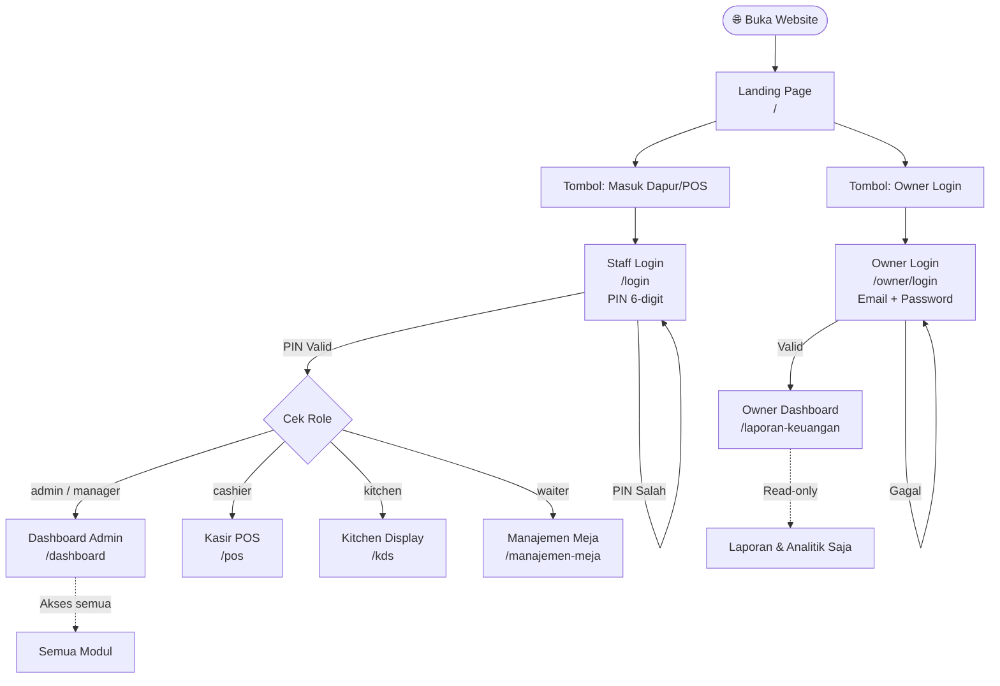
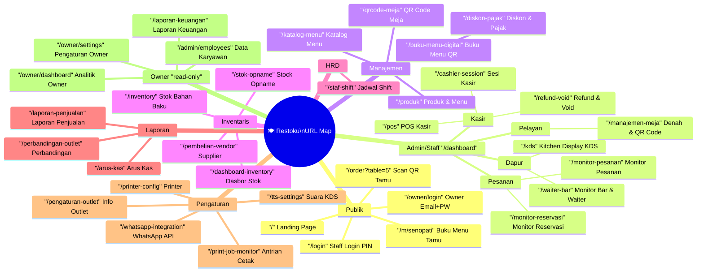
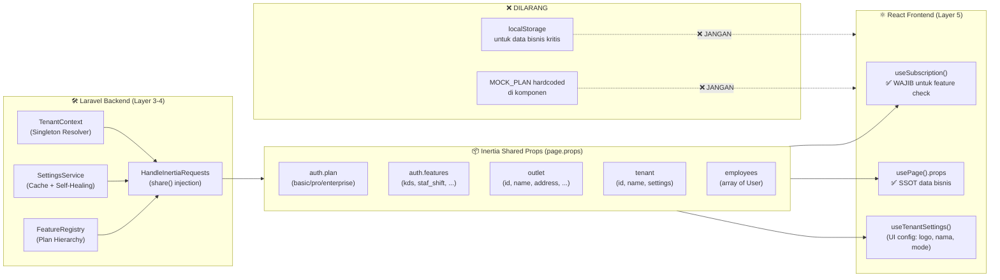

# 🏗️ Arsitektur Frontend Restoku — Panduan Visual

> **Dokumen ini adalah arsitektur resmi yang telah diverifikasi dan diperbarui sesuai kondisi codebase aktual.**
> Diperbarui: Juli 2026 | Framework: React 19 + TypeScript 5 + Inertia.js 2 + Tailwind CSS 4

---

## 1. User Flow — Alur Login per Role



---

## 2. Hierarki Komponen

```mermaid
flowchart LR
    subgraph ENTRY ["🚀 Entry Point"]
        MAIN["main.tsx\nInertia + ErrorBoundary"]
    end

    subgraph LAYOUTS ["📐 Layouts/"]
        ML["MainLayout.tsx\n(Admin/Staff Shell)"]
        OL["OwnerLayout.tsx\n(Owner Shell)"]
        AL["AuthLayout.tsx\n(Login Pages Shell)"]
    end

    subgraph PAGES ["📄 Pages/ (Thin Wrappers)"]
        direction TB
        P1["Dashboard/Index.tsx"]
        P2["POS/Index.tsx"]
        P3["KDS/Index.tsx"]
        P4["Auth/StaffLogin.tsx"]
        P5["Auth/OwnerLogin.tsx"]
        P6["Owner/..."]
        PDOTS["... 22 halaman lainnya"]
    end

    subgraph COMPONENTS ["🧩 Components/"]
        direction TB
        SHARED["shared/ ✅ AKTIF\n(Button, Input, Badge,\nGlass, Screen,\nErrorBoundary, index.ts)"]
        SHAREDSHIM["Shared.tsx ⚠️ SHIM\n(Re-export dari shared/\nuntuk backward compat)"]
        POSCOMP["POS/\n(CashierSession,\nReceiptPreview,\nRefundVoidManager)"]
        SETTINGSCOMP["Settings/\n(TTSSettings, PrinterConfig,\nPrintJobMonitor)"]
        OWNCOMP["Owner/\n(OwnerDashboard,\nOwnerSettings, FinancialReports)"]
        UI["ui/\n(Shadcn Primitives\n48 file)"]
    end

    subgraph LIB ["📦 lib/"]
        CONST["constants.ts\n(MOCK_PLAN, ORDER_STATUS\nPLAN_FEATURES, TAX_LABELS...)"]
        FMT["formatters.ts\n(formatRupiah,\nformatDate...)"]
        UTILS["utils.ts\n(cn(), debounce,\ngroupBy...)"]
    end

    subgraph HOOKS ["🎣 Hooks/"]
        USESUB["useSubscription.ts\n(✅ SSOT — Plan & Feature Check)"]
        USECART["useCart.ts"]
        USETTS["useTTS.ts"]
    end

    subgraph TYPES ["🔷 Types/"]
        TM["menu.ts"]
        TO["order.ts"]
        TS["staff.ts"]
        TOUT["outlet.ts"]
        TI["index.ts (barrel)"]
    end

    MAIN --> LAYOUTS
    LAYOUTS --> PAGES
    PAGES --> COMPONENTS
    COMPONENTS --> LIB
    COMPONENTS --> HOOKS
    COMPONENTS --> TYPES
    LIB --> TYPES
```



---

## 3. Peta URL & Halaman (50 Route Terverifikasi)



---

## 4. Alur Data — SSOT via Inertia Shared Props (✅ ARSITEKTUR AKTUAL)



---

## 5. Struktur Folder `resources/js/` (Kondisi Aktual)

```
resources/js/
│
├── main.tsx                    # Entry: Inertia + ErrorBoundary
├── vite-env.d.ts
│
├── Types/                      # ✅ Shared TypeScript interfaces
│   ├── index.ts                # Barrel export semua types
│   ├── menu.ts                 # MenuItem, Category, Variant, Ingredient
│   ├── order.ts                # Order, OrderItem, PaymentMethod, Receipt
│   ├── staff.ts                # Staff, ShiftSchedule, PayrollRecord
│   └── outlet.ts               # Outlet, Table, InventoryItem, DailySummary
│
├── lib/                        # ✅ Utilities & constants terpusat
│   ├── constants.ts            # MOCK_PLAN, ORDER_STATUS, PLAN_FEATURES, TAX_LABELS...
│   ├── formatters.ts           # formatRupiah, formatDate, formatTime...
│   └── utils.ts                # cn(), debounce, groupBy, truncate...
│
├── Hooks/                      # ✅ Custom React Hooks
│   ├── useSubscription.ts      # ✅ SSOT Plan & Feature Gate checker
│   ├── useCart.ts              # Cart state management untuk POS
│   └── useTTS.ts               # TTS (Text-to-Speech) untuk KDS
│
├── Layouts/
│   ├── MainLayout.tsx          # Shell admin/staff (dark sidebar)
│   ├── OwnerLayout.tsx         # Shell owner (emerald accent)
│   └── AuthLayout.tsx          # Shell login pages (split screen)
│
├── Components/
│   ├── shared/                 # ✅ Design system per file
│   │   ├── index.ts            # Barrel export semua shared primitives
│   │   ├── Button.tsx          # Button (4 variant, loading state)
│   │   ├── Input.tsx           # Input (label, error, hint)
│   │   ├── Badge.tsx           # Badge (9 tone, dot indicator)
│   │   ├── Glass.tsx           # Glass card (hover lift option)
│   │   ├── Screen.tsx          # Page wrapper (title, actions, live badge)
│   │   └── ErrorBoundary.tsx   # React error boundary (styled)
│   ├── Shared.tsx              # ⚠️ SHIM — Re-exports dari shared/ + useTenantSettings
│   ├── LandingPage.tsx         # Landing page component
│   ├── ProductImage.tsx        # Komponen gambar produk dengan fallback
│   ├── RoleGuard.tsx           # Komponen pembatas akses berdasarkan role
│   ├── POS/                    # POS-specific components
│   ├── HRD/                    # HR & payroll components
│   ├── Inventory/              # Inventory management components
│   ├── Owner/                  # Owner dashboard & settings components
│   │   └── OwnerSettings.tsx   # Profil & notifikasi owner
│   ├── Settings/               # Pengaturan outlet components
│   │   ├── TTSSettings.tsx     # Pengaturan suara TTS KDS
│   │   ├── PrinterConfig.tsx   # Konfigurasi printer thermal
│   │   └── PrintJobMonitor.tsx # Monitor antrian cetak
│   ├── Admin/                  # Admin-only components
│   ├── QR/                     # QR code components
│   └── ui/                     # Shadcn/UI primitives (48 files)
│
└── Pages/                      # Inertia page components (thin wrappers)
    ├── Auth/
    │   ├── StaffLogin.tsx
    │   └── OwnerLogin.tsx
    ├── Dashboard/
    ├── POS/
    ├── KDS/
    ├── PengaturanOutlet/       # ✅ Multi-tab settings page (5 tabs)
    │   └── Index.tsx
    ├── Owner/
    └── ... (22+ modul lainnya)
```

---

## 6. Konvensi & Panduan Pengembangan

### ✅ Import Pattern yang Benar
```typescript
// Types — selalu dari Types/
import type { MenuItem, Order } from "../../Types";

// Business constants & formatters
import { ORDER_STATUS, PLAN_FEATURES } from "../../lib/constants";
import { formatRupiah, formatDate } from "../../lib/formatters";

// Design system — dari Shared (re-export dari shared/)
import { Button, Input, Badge, Glass, Screen, useTenantSettings } from "../../Components/Shared";

// Feature gating — WAJIB untuk semua feature-locked UI
import { useSubscription } from "../../Hooks/useSubscription";

// Inertia SSOT props
import { usePage } from "@inertiajs/react";

// Layouts
import MainLayout  from "../../Layouts/MainLayout";   // Admin/Staff
import OwnerLayout from "../../Layouts/OwnerLayout";  // Owner (read-only)
import AuthLayout  from "../../Layouts/AuthLayout";   // Login pages
```

### ❌ Jangan Gunakan Ini
```typescript
// JANGAN gunakan localStorage untuk data bisnis kritis
const plan = localStorage.getItem('plan'); // ❌ gunakan useSubscription()

// JANGAN hardcode subscription/plan check
const isKdsEnabled = true; // ❌ gunakan useSubscription().canAccess('kds')

// JANGAN definisikan tipe inline di komponen
interface MyLocalOrder { id: string; } // ❌ duplikasi, gunakan Types/order.ts

// JANGAN hardcode konstanta tarif langsung
const TAX_RATE = 0.11; // ❌ gunakan nilai dari Inertia props/usePage().props
```

### Aturan Mode Terang/Gelap (Theming)
```typescript
// ✅ Cara benar: baca isLight dari useTenantSettings
const { isLight } = useTenantSettings();
const labelClass = `text-xs font-semibold ${isLight ? "text-slate-700" : "text-slate-400"}`;

// ❌ JANGAN: hardcode warna tanpa mempertimbangkan mode
<label className="text-slate-400">Label</label> // tidak responsif terhadap mode terang
```

---

## 7. Aturan Struktur File

| Kategori | Lokasi | Contoh |
|----------|--------|--------|
| Tipe domain | `Types/` | `Order`, `MenuItem`, `Staff` |
| Konstanta bisnis | `lib/constants.ts` | `PLAN_FEATURES`, `ORDER_STATUS` |
| Formatter | `lib/formatters.ts` | `formatRupiah()`, `formatDate()` |
| Utilitas umum | `lib/utils.ts` | `cn()`, `debounce()` |
| Primitif UI | `Components/shared/` | `Button`, `Input`, `Badge` |
| Komponen fitur | `Components/<domain>/` | `Settings/PrinterConfig.tsx` |
| Halaman (thin) | `Pages/<domain>/` | `Pages/PengaturanOutlet/Index.tsx` |
| Layout shells | `Layouts/` | `MainLayout`, `OwnerLayout` |

---

## 8. Ringkasan Perubahan Audit

| # | Masalah Lama | Solusi Baru | Status |
|---|-------------|-------------|--------|
| 1 | `Types/` kosong | Diisi 4 file + barrel export | ✅ Selesai |
| 2 | Constants berserakan di `Shared.tsx` | Dipindah ke `lib/constants.ts` | ✅ Selesai |
| 3 | `formatRupiah` di design system file | Dipindah ke `lib/formatters.ts` | ✅ Selesai |
| 4 | Tidak ada `lib/utils.ts` / `cn()` | Dibuat baru | ✅ Selesai |
| 5 | `Shared.tsx` monolitik | Dipecah ke `Components/shared/` per file | ✅ Selesai |
| 6 | `ErrorBoundary` inline di `main.tsx` | Dipindah ke `Components/shared/ErrorBoundary.tsx` | ✅ Selesai |
| 7 | `main.tsx` kotor dengan class component | Dibersihkan, hanya 20 baris | ✅ Selesai |
| 8 | Tidak ada `OwnerLayout` | Dibuat `Layouts/OwnerLayout.tsx` | ✅ Selesai |
| 9 | Tidak ada `AuthLayout` | Dibuat `Layouts/AuthLayout.tsx` | ✅ Selesai |
| 10 | `Components/figma/` di production | Dihapus | ✅ Selesai |
| 11 | Data flow via localStorage untuk bisnis | Dimigrasi ke Inertia Shared Props + useSubscription | ✅ Selesai |
| 12 | Diagram alur data tidak akurat | Diperbarui sesuai arsitektur SSOT aktual | ✅ Diperbarui |
| 13 | URL map tidak lengkap (hanya 18 route) | Ditambahkan 50 route terverifikasi E2E | ✅ Diperbarui |
| 14 | `Hooks/` tidak mencantumkan `useSubscription` | Ditambahkan sebagai hook utama wajib | ✅ Diperbarui |
| 15 | `Settings/` dan `Owner/` components tidak terdokumentasi | Ditambahkan ke struktur folder | ✅ Diperbarui |
