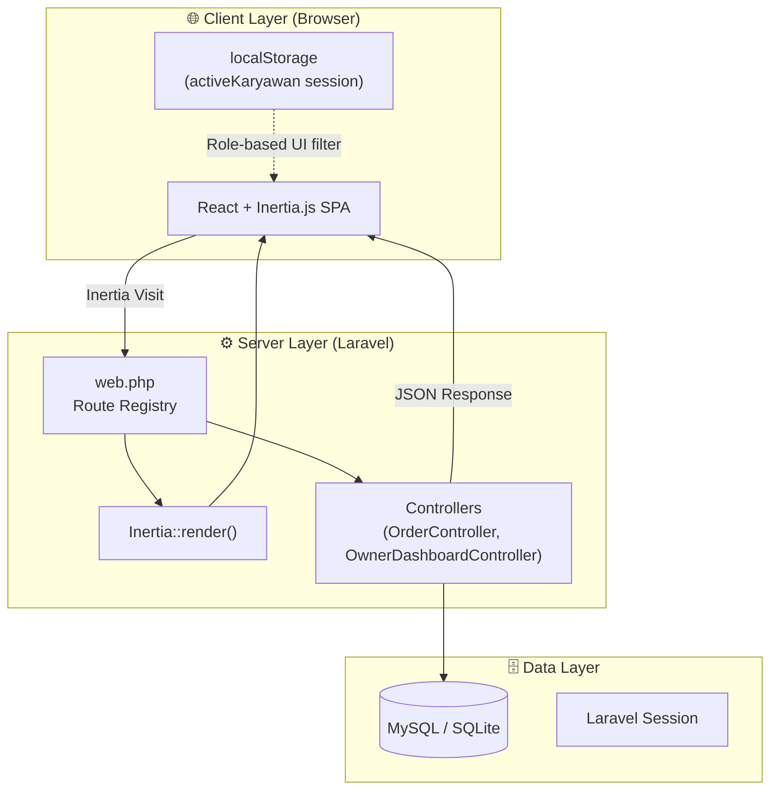
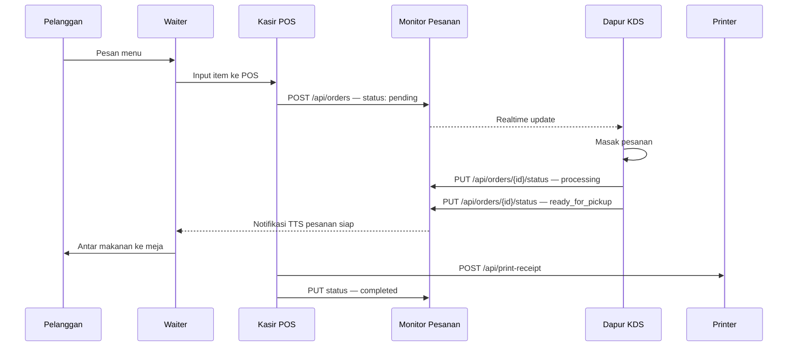
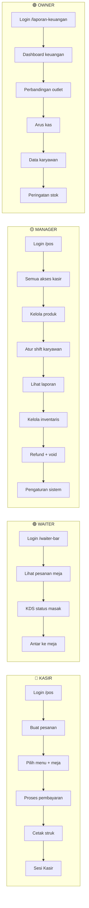
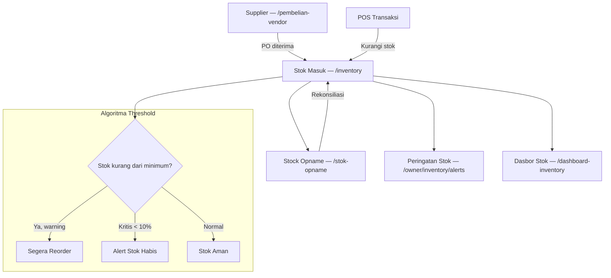
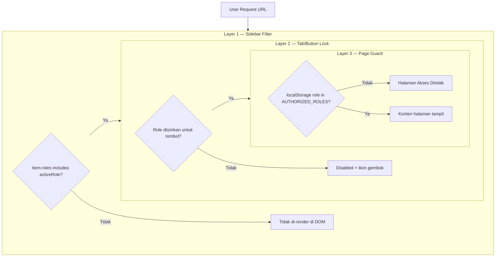
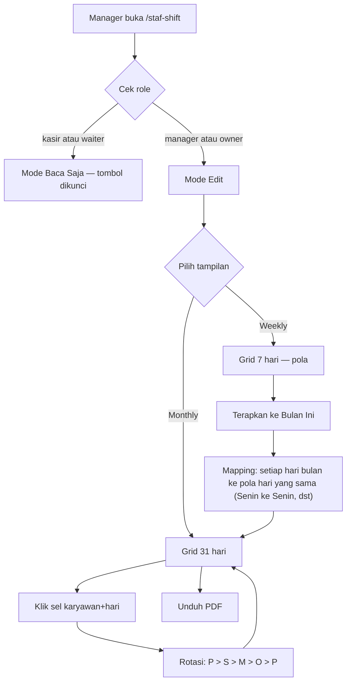
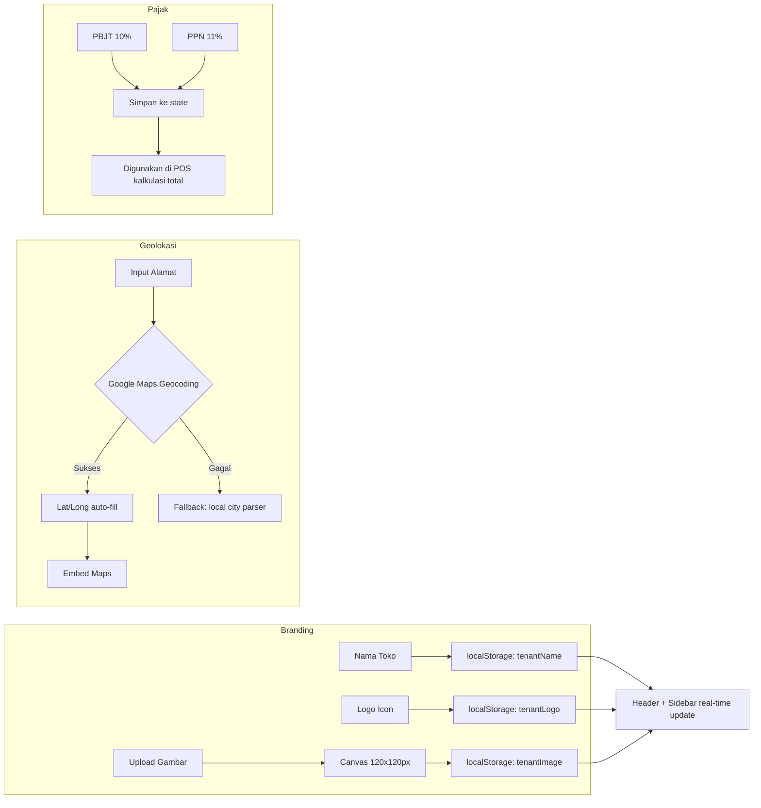

# 🗺️ Restoku POS — Route, Workflow & Data Flow Documentation

> **Versi:** Juli 2026 · **Stack:** Laravel 11 + Inertia.js + React + Vite
> Dokumen ini mencakup seluruh route, alur kerja, algoritma data, dan diagram visual sistem Restoku POS.

---

## 📐 Arsitektur Sistem (High-Level)



---

## 🔑 Auth & Session Flow

```mermaid
flowchart TD
    START([Buka Aplikasi]) --> LANDING[/ Landing Page /]

    LANDING --> CHOICE{Login sebagai?}

    CHOICE -->|Staff| SLOGIN[/login — Staff PIN Pad]
    CHOICE -->|Owner| OLOGIN[/owner/login — Email + Password]

    SLOGIN --> PIN{Verifikasi PIN}
    PIN -->|"123456 — Kasir"| SAVE_K["localStorage: name=BUDI HARTONO, role=kasir"]
    PIN -->|"654321 — Waiter"| SAVE_W["localStorage: name=SARI PERTIWI, role=waiter"]
    PIN -->|"999999 — Manager"| SAVE_M["localStorage: name=AGUS SETIAWAN, role=manager"]
    PIN -->|PIN salah| ERR["❌ Error shake — Reset PIN"]
    ERR --> SLOGIN

    SAVE_K --> POS[/pos — Kasir Dashboard]
    SAVE_W --> WAITER[/waiter-bar — Waiter Dashboard]
    SAVE_M --> POS

    OLOGIN --> AUTH{Laravel Auth}
    AUTH -->|Berhasil| OWNER_DASH[/laporan-keuangan — Owner Dashboard]
    AUTH -->|Gagal| OLOGIN
```

---

## 📋 Tabel Route Lengkap (45 Routes)

| # | URL | Method | Page Component | Min. Role | Plan |
|---|-----|--------|----------------|-----------|------|
| 1 | `/` | GET | `LandingPage/Index` | Public | — |
| 2 | `/login` | GET | `Auth/StaffLogin` | Public | — |
| 3 | `/owner/login` | GET | `Auth/OwnerLogin` | Public | — |
| 4 | `/dashboard` | GET | `Dashboard/Index` | Kasir | Basic |
| 5 | `/laporan-keuangan` | GET | `Dashboard/Reports` | Owner | Pro |
| 6 | `/pos` | GET | `POS/Index` | Kasir | Basic |
| 7 | `/monitor-pesanan` | GET | `MonitorPesanan/Index` | Kasir | Basic |
| 8 | `/kds` | GET | `KDS/Index` | Waiter | Enterprise |
| 9 | `/refund-void` | GET | `RefundVoidManager/Index` | Manager | Pro |
| 10 | `/produk` | GET | `ProdukMenu/Index` | Manager | Basic |
| 11 | `/katalog-menu` | GET | `KatalogMenu/Index` | Kasir | Basic |
| 12 | `/buku-menu-digital` | GET | `QRCodeMeja/Index` | Manager | Pro |
| 13 | `/manajemen-meja` | GET | `ManajemenMeja/Index` | Kasir | Basic |
| 14 | `/inventory` | GET | `Inventory/Index` | Manager | Pro |
| 15 | `/pembelian-vendor` | GET | `PembelianVendor/Index` | Manager | Pro |
| 16 | `/stok-opname` | GET | `StokOpname/Index` | Manager | Enterprise |
| 17 | `/dashboard-inventory` | GET | `DashboardInventory/Index` | Manager | Pro |
| 18 | `/staf-shift` | GET | `StafShift/Index` | Manager | Pro |
| 19 | `/cashier-session` | GET | `CashierSession/Index` | Kasir | Pro |
| 20 | `/laporan-penjualan` | GET | `LaporanPenjualan/Index` | Manager | Basic |
| 21 | `/perbandingan-outlet` | GET | `PerbandinganOutlet/Index` | Owner | Pro |
| 22 | `/arus-kas` | GET | `ArusKas/Index` | Owner | Pro |
| 23 | `/pengaturan-outlet` | GET | `PengaturanOutlet/Index` | Manager | Basic |
| 24 | `/diskon-pajak` | GET | `DiskonPajak/Index` | Manager | Basic |
| 25 | `/qrcode-meja` | GET | `QRCodeMeja/Index` | Manager | Basic |
| 26 | `/printer-config` | GET | `PrinterConfig/Index` | Manager | Basic |
| 27 | `/print-job-monitor` | GET | `PrintJobMonitor/Index` | Manager | Pro |
| 28 | `/tts-settings` | GET | `TTSSettings/Index` | Manager | Basic |
| 29 | `/whatsapp-integration` | GET | `WhatsAppIntegration/Index` | Manager | Enterprise |
| 30 | `/order?table=N` | GET | `BukuMenuDigital/CustomerView` | Tamu | — |
| 31 | `/m/{outlet}` | GET | `BukuMenuDigital/CustomerView` | Tamu | — |
| 32 | `/waiter-bar` | GET | `WaiterBar/Index` | Waiter | Basic |
| 33 | `/owner/employees` | GET | `Owner/Employees` | Owner | Basic |
| 34 | `/owner/inventory/alerts` | GET | `Owner/InventoryAlerts` | Owner | Basic |
| 35 | `/owner/settings` | GET | `Owner/Settings` | Owner | Basic |
| 36 | `/admin/employees` | GET | `Admin/Employees` | Manager | Basic |
| **37** | **`/api/orders`** | **GET** | **OrderController@getKdsOrders** | — | — |
| **38** | **`/api/orders`** | **POST** | **OrderController@submitOrder** | — | — |
| **39** | **`/api/orders/{id}`** | **GET** | **OrderController@getOrderStatus** | — | — |
| **40** | **`/api/orders/{id}/status`** | **PUT** | **OrderController@updateOrderStatus** | — | — |
| **41** | **`/api/print-jobs`** | **GET** | **OrderController@getPrintJobs** | — | — |
| **42** | **`/api/cashier-queue`** | **GET** | **OrderController@getCashierQueue** | — | — |
| **43** | **`/api/cashier-queue/{id}`** | **DELETE** | **OrderController@clearCashierQueueItem** | — | — |
| **44** | **`/api/print-receipt`** | **POST** | **OrderController@printReceipt** | — | — |
| **45** | **`/api/receipt-config`** | **GET/POST** | **OrderController@getReceiptConfig** | — | — |

---

## 🧭 Sidebar RBAC Matrix (Role × Menu)

| Grup | Menu | Kasir 🔵 | Waiter 🟢 | Manager 🟡 | Owner 🟣 |
|------|------|:---:|:---:|:---:|:---:|
| **UTAMA** | Dashboard | ✅ | ✅ | ✅ | ✅ |
| | Kasir (POS) | ✅ | ❌ | ✅ | ✅ |
| | Monitor Pesanan | ✅ | ✅ | ✅ | ✅ |
| | Dapur (KDS) | ❌ | ✅ | ✅ | ✅ |
| | Refund & Void | ❌ | ❌ | ✅ | ✅ |
| **MANAJEMEN** | Produk & Menu | ❌ | ❌ | ✅ | ✅ |
| | Katalog Menu | ✅ | ✅ | ✅ | ✅ |
| | Buku Menu Digital | ❌ | ❌ | ✅ | ✅ |
| | Manajemen Meja | ✅ | ✅ | ✅ | ✅ |
| **INVENTARIS** | Stok (Bahan Baku) | ❌ | ❌ | ✅ | ✅ |
| | Supplier | ❌ | ❌ | ✅ | ✅ |
| | Stock Opname | ❌ | ❌ | ✅ | ✅ |
| | Dasbor Stok | ❌ | ❌ | ✅ | ✅ |
| **OPERASIONAL** | Shift Kerja | ❌ | ❌ | ✅ | ✅ |
| | Sesi Kasir | ✅ | ❌ | ✅ | ✅ |
| **LAPORAN** | Laporan Penjualan | ❌ | ❌ | ✅ | ✅ |
| | Perbandingan Outlet | ❌ | ❌ | ❌ | ✅ |
| | Arus Kas | ❌ | ❌ | ❌ | ✅ |
| **PENGATURAN** | Pengaturan Outlet | ❌ | ❌ | ✅ | ✅ |
| | Diskon & Pajak | ❌ | ❌ | ✅ | ✅ |
| | QR Code Meja | ❌ | ❌ | ✅ | ✅ |
| | Printer Config | ❌ | ❌ | ✅ | ✅ |
| | Antrean Cetak | ❌ | ❌ | ✅ | ✅ |
| | Pengaturan TTS | ❌ | ❌ | ✅ | ✅ |
| | WhatsApp API | ❌ | ❌ | ✅ | ✅ |
| **OWNER VIEW** | Data Karyawan | ❌ | ❌ | ❌ | ✅ |
| | Peringatan Stok | ❌ | ❌ | ❌ | ✅ |
| | Pengaturan Owner | ❌ | ❌ | ❌ | ✅ |

---

## 🛒 Order Lifecycle — Sequence Diagram



---

## 🏪 User Journey per Role



---

## 📦 Data Flow Inventaris



---

## 🖨️ Printer & Receipt Flow

```mermaid
flowchart TD
    POS_ORDER[POS: Transaksi Selesai] --> AUTO{Auto Print aktif?}
    AUTO -->|Ya| QUEUE[POST /api/print-receipt]
    AUTO -->|Tidak| MANUAL[Tombol Print Manual]
    MANUAL --> QUEUE
    QUEUE --> CONFIG[GET /api/receipt-config]
    CONFIG --> RENDER[Render HTML Struk]
    RENDER --> PRINTER{Tipe Printer}
    PRINTER -->|Thermal 58mm| T58[Cetak 58mm]
    PRINTER -->|Thermal 80mm| T80[Cetak 80mm]
    PRINTER -->|PDF| PDF[Download PDF]
    MONITOR[/print-job-monitor] --> JOB_LIST[GET /api/print-jobs]
```

---

## 🔐 Defense in Depth — Role Access Layers



---

## 🏷️ Plan Feature Gating

```mermaid
flowchart LR
    subgraph BASIC["Basic"]
        B1[QR Order]
        B2[Thermal Print]
        B3[QRIS + GoPay]
        B4[PBJT Tax]
        B5[Produk & Menu]
    end

    subgraph PRO["Pro (aktif saat ini)"]
        P1[Semua Basic]
        P2[PPN 11% + Service Charge]
        P3[Buku Menu Digital]
        P4[Shift Management]
        P5[WhatsApp Notif]
        P6[Multi Outlet 3]
        P7[Auto Print]
        P8[Laporan Excel]
    end

    subgraph ENT["Enterprise"]
        E1[Semua Pro]
        E2[KDS Dapur]
        E3[White Label]
        E4[Stock Opname Lanjut]
        E5[Payroll]
        E6[WhatsApp API Integration]
        E7[Unlimited Outlet]
        E8[Priority Support]
    end

    BASIC --> PRO --> ENT
```



---

## 📅 Shift Algoritma — Pola Mingguan ke Bulanan



---

## ⚙️ Pengaturan Outlet — Data Flow



---

## 🗂️ Ringkasan Statistik

| Kategori | Jumlah |
|----------|--------|
| Route halaman (GET) | 35 |
| API Endpoints | 10 |
| **Total Routes** | **45** |
| Menu sidebar (total) | 28 |
| Komponen halaman | 36+ |
| Role pengguna | 4 |
| Tier plan | 3 |

---

*Dokumen ini di-generate dari analisis kode sumber Restoku POS.*
*Terakhir diperbarui: Juli 2026*
